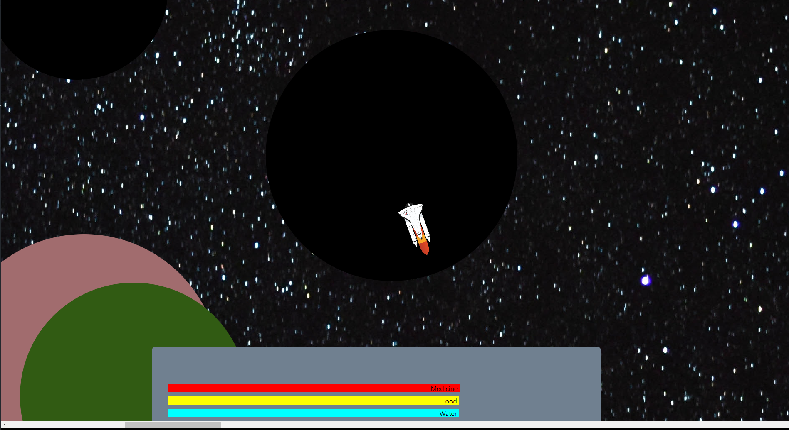

# Hack the Planet
[](https://planet-hack.herokuapp.com/)



An exploration of game development. Built for MLH Summer League event, To The Moon And Hack.

# Stack
## React.js | Ruby on Rails | Heroku | PostgreSQL
___
## Running locally

* Clone repo
* Install dependencies by running:
```bash
bundle && rake start:prep
```
* Start front and back-end servers
```bash
rake start
```
